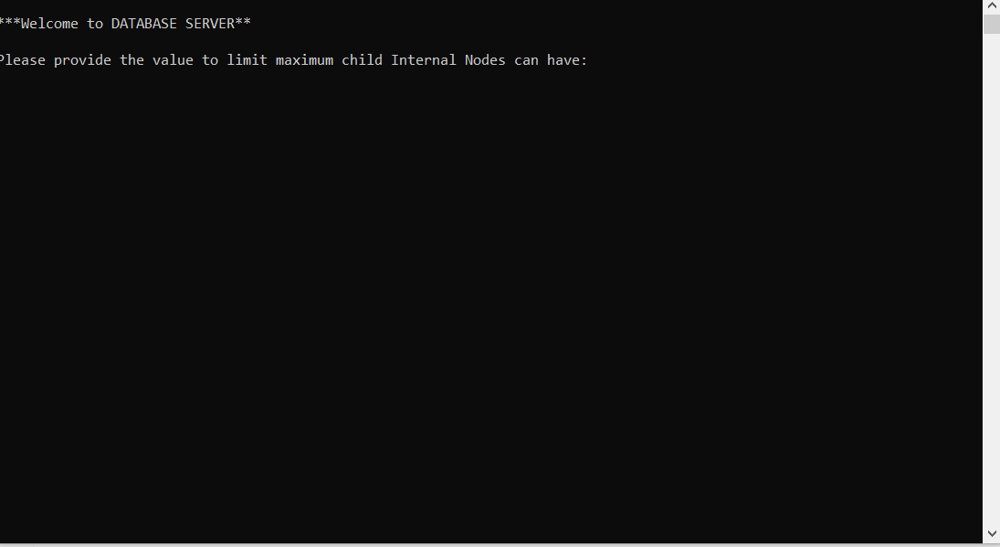

# B+ Tree Project
Implementing B+ tree using C++
- Search 
- Insert
- Delete

In this project, we implement the B+ Tree for fast and efficient access of files in the disc. The file is stored as a .txt file in DBFiles folder corresponding FILE* will be saved in the leaf node. Above step is done to mimic the disc-block access. *(TO-DO Delete the files in DBFiles folder after each run)*. If we want
to make more tables then we can make that many BPTree objects !!

## B+ Tree implementation working demo :

